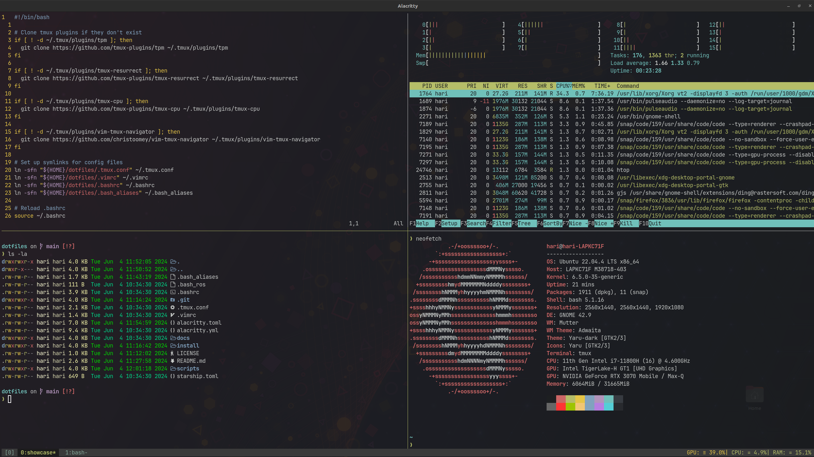

# Dotfiles

Welcome to my dotfiles repository! This repository contains all the configuration files and setup scripts I use to configure my development environment. Feel free to use and adapt them to your needs. 

Please review config files and scripts before installing them, as these are configured for my usage.

These configurations are tested in Ubuntu 20.04 & 22.04



## Contents

- [Files and Directories](#files-and-directories)
- [Installation](#installation)
- [Usage](#usage)
- [Contributing](#contributing)
- [License](#license)

## Files and Directories

- **docs/**: Directory containing documentation related to the configurations and scripts.
- **scripts/**: Directory containing setup scripts.
  - `install_essentials.sh`: Script to install essential packages.
  - `setup.sh`: Script to set up the development environment.
- `.bash_aliases`: Bash aliases configuration file.
- `.bash_ros`: Bash configuration for ROS (Robot Operating System).
- `.bashrc`: Main Bash configuration file.
- `.tmux.conf`: Tmux configuration file.
- `.vimrc`: Vim configuration file.
- `alacritty.toml`: Configuration file for the Alacritty terminal emulator.
- `starship.toml`: Configuration file for the Starship prompt.

## Installation

To set up your environment using these dotfiles, follow the steps below:

1. Clone the repository to your local machine:

   ```bash
   git clone https://github.com/HariP19/dotfiles.git
   cd dotfiles
   ```

2. Run the install and setup scripts:
    ```bash
    ./scripts/install_essentials.sh
    ./scripts/setup.sh
    ```
3. Refer [docs/alacritty.md](docs/alacritty.md) to install and configure [alacritty](https://alacritty.org/) (recommended if you're using starship)

## Usage

### Bash Configuration
- **Aliases:** The `.bash_aliases` file contains useful command shortcuts.
- **ROS:** The `.bash_ros` file sets up the environment for ROS development.
- **Bash Config:** The `.bashrc` file includes general Bash configurations and sources the other Bash files.

### Tmux
- The **.tmux.conf** file configures Tmux, enhancing your terminal multiplexing experience.

### Vim
- The **.vimrc** file contains configurations for Vim, improving the text editing experience.

### Alacritty
- The **alacritty.yml** file customizes the Alacritty terminal emulator.

### Starship
- The **starship.toml** file configures the Starship prompt to provide a minimal, fast, and customizable prompt.


## Contributions
Contributions are welcome! If you have improvements or suggestions, feel free to open a pull request or submit an issue. 

## License
This project is licensed under the MIT License. See the [LICENSE](LICENSE) file for details.